# BMad Method — User Guide

This guide will help you understand and effectively use the BMad Method for agile AI-driven planning and development, adapted for upfront planning in Chatwise (our LLM chat application) and development in Replit as the IDE.

## The BMad Plan and Execute Workflow

BMad separates high-level planning from the development cycle. Planning is done in a powerful chat interface (Chatwise) and all development, including document sharding, happens within the IDE (Replit).

### The Planning Workflow (Chatwise LLM Chat)

Before development begins, BMad follows a structured planning workflow performed in Chatwise for efficiency using models like Gemini Pro 2.5, Opus 4.1, or Sonnet 4.5. This phase concludes when the PRD and Architecture documents are finalized.

```mermaid
graph TD
    subgraph "Phase 1: Planning in Chatwise"
        A["Start: Project Idea"] --> B{"Optional: Analyst Research"}
        B -->|Yes| C["Analyst: Brainstorming (Optional)"]
        B -->|No| G{"Project Brief Available?"}
        C --> C2["Analyst: Market Research (Optional)"]
        C2 --> C3["Analyst: Competitor Analysis (Optional)"]
        C3 --> D["Analyst: Create Project Brief"]
        D --> G
        G -->|Yes| E["PM: Create PRD from Brief (Fast Track)"]
        G -->|No| E2["PM: Interactive PRD Creation (More Questions)"]
        E --> F["PRD Created with FRs, NFRs, Epics & Stories"]
        E2 --> F
        F --> F2{"UX Required?"}
        F2 -->|Yes| F3["UX Expert: Create Front End Spec"]
        F2 -->|No| H["Architect: Create Architecture from PRD"]
        F3 --> F4["UX Expert: Generate UI Prompt for Lovable/V0 (Optional)"]
        F4 --> H2["Architect: Create Architecture from PRD + UX Spec"]
        H --> Q{"Early Test Strategy? (Optional)"}
        H2 --> Q
        Q -->|Yes| R["QA: Early Test Architecture Input on High-Risk Areas"]
        Q -->|No| I
        R --> I["PO: Run Master Checklist"]
        I --> J{"Documents Aligned?"}
        J -->|Yes| K["Planning Complete"]
        J -->|No| L["PO: Update Epics & Stories"]
        L --> M["Update PRD/Architecture as needed"]
        M --> I
        K --> N["✅ Planning Docs Finalized. Ready to Switch to IDE."]
    end

    style A fill:#f5f5f5,color:#000
    style B fill:#e3f2fd,color:#000
    style C fill:#e8f5e9,color:#000
    style C2 fill:#e8f5e9,color:#000
    style C3 fill:#e8f5e9,color:#000
    style D fill:#e8f5e9,color:#000
    style E fill:#fff3e0,color:#000
    style E2 fill:#fff3e0,color:#000
    style F fill:#fff3e0,color:#000
    style F2 fill:#e3f2fd,color:#000
    style F3 fill:#e1f5fe,color:#000
    style F4 fill:#e1f5fe,color:#000
    style G fill:#e3f2fd,color:#000
    style H fill:#f3e5f5,color:#000
    style H2 fill:#f3e5f5,color:#000
    style Q fill:#e3f2fd,color:#000
    style R fill:#ffd54f,color:#000
    style I fill:#f9ab00,color:#fff
    style J fill:#e3f2fd,color:#000
    style L fill:#f9ab00,color:#fff
    style M fill:#fff3e0,color:#000
    style K fill:#34a853,color:#fff
    style N fill:#1a73e8,color:#fff
```



#### Chatwise to Replit Transition

**Critical Transition Point**: Once planning in Chatwise is complete, you must switch to Replit to begin the setup and development workflow:

1.  **Copy Documents to Project**: Copy the finalized `docs/prd.md` and `docs/architecture.md` from Chatwise into your project's `docs` folder in Replit.
2.  **Switch to Replit**: Open your project in Replit, which serves as your Agentic IDE.
3.  **Shard Documents in Replit**: The first task inside the IDE is **Document Sharding**. Use the PO agent to shard the PRD and then the Architecture documents into smaller, manageable files.
4.  **Begin Development**: With documents sharded, start the Core Development Cycle.

### The Core Development Cycle (Replit IDE)

Once you are in Replit, the first step is to shard the planning documents. After that, the development cycle begins.

```mermaid
graph TD
    subgraph "Phase 2: Setup and Development in Replit IDE"
        O["PO: Shard Documents (PRD & Architecture)"] --> P["Ready for SM/Dev Cycle"]
        P --> A["Development Phase Start"]
        A --> B["SM: Reviews Previous Story Dev/QA Notes"]
        B --> B2["SM: Drafts Next Story from Sharded Epic + Architecture"]
        B2 --> S{"High-Risk Story? (Optional)"}
        S -->|Yes| T["QA: *risk + *design on Draft Story"]
        S -->|No| B3
        T --> U["Test Strategy & Risk Profile Created"]
        U --> B3{"PO: Validate Story Draft (Optional)"}
        B3 -->|Validation Requested| B4["PO: Validate Story Against Artifacts"]
        B3 -->|Skip Validation| C{"User Approval"}
        B4 --> C
        C -->|Approved| D["Dev: Sequential Task Execution"]
        C -->|Needs Changes| B2
        D --> E["Dev: Implement Tasks + Tests"]
        E --> V{"Mid-Dev QA Check? (Optional)"}
        V -->|Yes| W["QA: *trace or *nfr for Early Validation"]
        V -->|No| F
        W --> X["Dev: Address Coverage/NFR Gaps"]
        X --> F["Dev: Run All Validations"]
        F --> G["Dev: Mark Ready for Review + Add Notes"]
        G --> H{"User Verification"}
        H -->|Request QA Review| I["QA: Test Architect Review + Quality Gate"]
        H -->|Approve Without QA| M["IMPORTANT: Verify All Regression Tests and Linting are Passing"]
        I --> J["QA: Test Architecture Analysis + Active Refactoring"]
        J --> L{"QA Decision"}
        L -->|Needs Dev Work| D
        L -->|Approved| M
        H -->|Needs Fixes| D
        M --> N["IMPORTANT: COMMIT YOUR CHANGES BEFORE PROCEEDING!"]
        N --> Y{"Gate Update Needed?"}
        Y -->|Yes| Z["QA: *gate to Update Status"]
        Y -->|No| K
        Z --> K["Mark Story as Done"]
        K --> B
    end

    style O fill:#f9ab00,color:#fff
    style P fill:#34a853,color:#fff
    style A fill:#f5f5f5,color:#000
    style B fill:#e8f5e9,color:#000
    style B2 fill:#e8f5e9,color:#000
    style S fill:#e3f2fd,color:#000
    style T fill:#ffd54f,color:#000
    style U fill:#ffd54f,color:#000
    style B3 fill:#e3f2fd,color:#000
    style B4 fill:#fce4ec,color:#000
    style C fill:#e3f2fd,color:#000
    style D fill:#e3f2fd,color:#000
    style E fill:#e3f2fd,color:#000
    style V fill:#e3f2fd,color:#000
    style W fill:#ffd54f,color:#000
    style X fill:#e3f2fd,color:#000
    style F fill:#e3f2fd,color:#000
    style G fill:#e3f2fd,color:#000
    style H fill:#e3f2fd,color:#000
    style I fill:#f9ab00,color:#fff
    style J fill:#ffd54f,color:#000
    style L fill:#e3f2fd,color:#000
    style M fill:#ff5722,color:#fff
    style N fill:#d32f2f,color:#fff
    style Y fill:#e3f2fd,color:#000
    style Z fill:#ffd54f,color:#000
    style K fill:#34a853,color:#fff
```



## Prerequisites

Before installing BMad Method, ensure you have:

-   Access to Chatwise for planning.
-   A Replit account (free tier works for most projects).
-   **Node.js** ≥ 18, **npm** ≥ 9 (Replit supports these natively).
-   **Git** installed and configured (Replit has built-in Git support).

## Installation

### Plan in Chatwise

1.  Navigate to `web-bundles/teams/` in your BMad repository.
2.  Copy the contents of `team-fullstack.txt`.
3.  In Chatwise, create a new assistant and paste the file contents as the system prompt.
4.  Select your preferred model (Gemini Pro 2.5, Opus 4.1, or Sonnet 4.5).
5.  Type `/help` to see available commands and start planning.

### Shard and Develop in Replit

1.  Create or fork a new Replit project for your BMad workflow.
2.  Install BMad to the root of your Replit project folder.
3.  Copy planning artifacts (e.g., `docs/prd.md`) from Chatwise into your Replit project.
4.  **Use the Replit agent to shard documents.** Reference markdown prompt files with `@filename` (e.g., `@po-agent.md`) to load them into context and issue the sharding command.
5.  Proceed with the development cycle.

## Special Agents

### BMad-Master

This agent can do any task or command that all other agents can do, aside from actual story implementation. Use it in Replit to avoid switching between agent prompt files.

### BMad-Orchestrator

This heavyweight agent should **only be used in Chatwise** to facilitate the planning phase. **Do not use it in the Replit IDE.**

### How Agents Work

#### Agent Interaction

**In Chatwise (Planning):**

Use slash commands or direct prompts based on the system prompt (e.g., `/pm Create a PRD for a task management app`).

**In Replit (Development):**

Replit uses the `@` syntax to reference agent prompt files and bring them into context:

```bash
# To shard documents in Replit
@po-agent.md Shard the PRD

# Example development commands
@dev-agent.md Implement the user authentication
@qa-agent.md *risk {story}
@dev-agent.md Fix the login bug
```

## Replit Integration Best Practices

-   **Context Management**: Use `@filename` to selectively bring files into the agent's context window.
-   **Agent Selection**: Reference the appropriate agent Markdown file with `@` for each task.
-   **Commit Regularly**: Use Replit's built-in version control to save your work frequently.

## The Test Architect (QA Agent)

### Overview

The QA agent in BMad is not just a "senior developer reviewer" - it's a **Test Architect** with deep expertise in test strategy, quality gates, and risk-based testing. Named Quinn, this agent provides advisory authority on quality matters while actively improving code when safe to do so.

#### Quick Start (Essential Commands in Replit)

First, reference the QA agent: `@qa-agent.md`

```bash
@qa-agent.md *risk {story}       # Assess risks before development
@qa-agent.md *design {story}     # Create test strategy
@qa-agent.md *trace {story}      # Verify test coverage during dev
@qa-agent.md *nfr {story}        # Check quality attributes
@qa-agent.md *review {story}     # Full assessment → writes gate
```

### Core Capabilities

#### 1. Risk Profiling (`*risk`)

Identifies and assesses implementation risks before development.

#### 2. Test Design (`*design`)

Creates comprehensive test strategies to guide development.

#### 3. Requirements Tracing (`*trace`)

Maps requirements to test coverage during development.

#### 4. NFR Assessment (`*nfr`)

Validates non-functional requirements (Security, Performance, etc.).

#### 5. Comprehensive Test Architecture Review (`*review`)

Performs a full quality assessment after development is complete.

#### 6. Quality Gates (`*gate`)

Manages quality gate decisions (PASS/CONCERNS/FAIL).

### Working with the Test Architect

| **Stage**          | **Command** | **When to Use**         | **Value**                  |
| ------------------ | ----------- | ----------------------- | -------------------------- |
| **Story Drafting** | `*risk`     | After SM drafts story   | Identify pitfalls early    |
|                    | `*design`   | After risk assessment   | Guide dev on test strategy |
| **Development**    | `*trace`    | Mid-implementation      | Verify test coverage       |
|                    | `*nfr`      | While building features | Catch quality issues early |
| **Review**         | `*review`   | Story marked complete   | Full quality assessment    |
| **Post-Review**    | `*gate`     | After fixing issues     | Update quality decision    |

## Technical Preferences System

BMad includes a personalization system through the `technical-preferences.md` file located in `.bmad-core/data/`.

### Using with Chatwise and Replit

-   **Chatwise**: Include your `technical-preferences.md` content in the system prompt.
-   **Replit**: Provide the preferences file to the agent's context window, for example: `@architect-agent.md @technical-preferences.md Design the system architecture`.

## Core Configuration

The `.bmad-core/core-config.yaml` file configures BMad. The `devLoadAlwaysFiles` section is particularly important.

### Developer Context Files

Define which files the `dev` agent should always load:

```yaml
devLoadAlwaysFiles:
  - docs/architecture/coding-standards.md
  - docs/architecture/tech-stack.md
  - docs/architecture/project-structure.md
```

Ensure these files exist after sharding and contain the essential rules for your dev agent.

## Getting Help

-   **Discord Community**: [Join Discord](https://discord.gg/gk8jAdXWmj)
-   **GitHub Issues**: [Report bugs](https://github.com/bmadcode/bmad-method/issues)
-   **Documentation**: [Browse docs](https://github.com/bmadcode/bmad-method/docs)
-   **YouTube**: [BMadCode Channel](https://www.youtube.com/@BMadCode)

## Conclusion

Remember: BMad is designed to enhance your development process, not replace your expertise. Use it as a powerful tool to accelerate your projects while maintaining control over design decisions and implementation details.