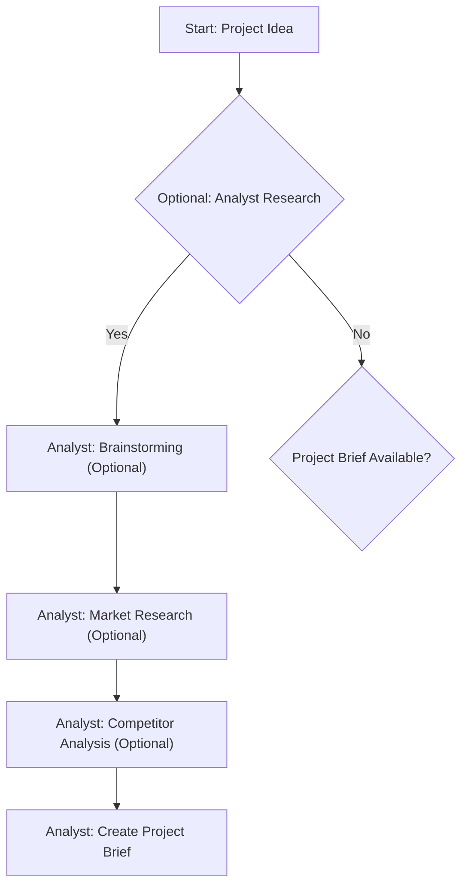

# Sample Markdown with Mermaid

This is a test markdown file with a Mermaid diagram.

## Project Flow

## Features

- Automatic markdown file detection
- Live Mermaid diagram rendering
- Clean, simple interface
- File browser sidebar

That's it!