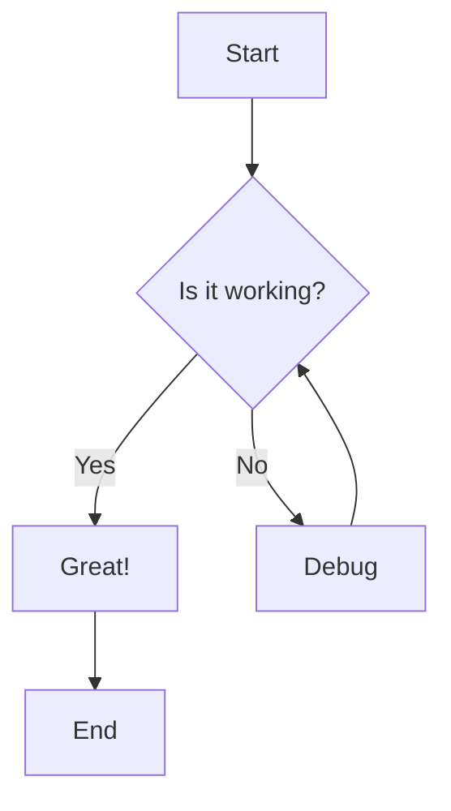
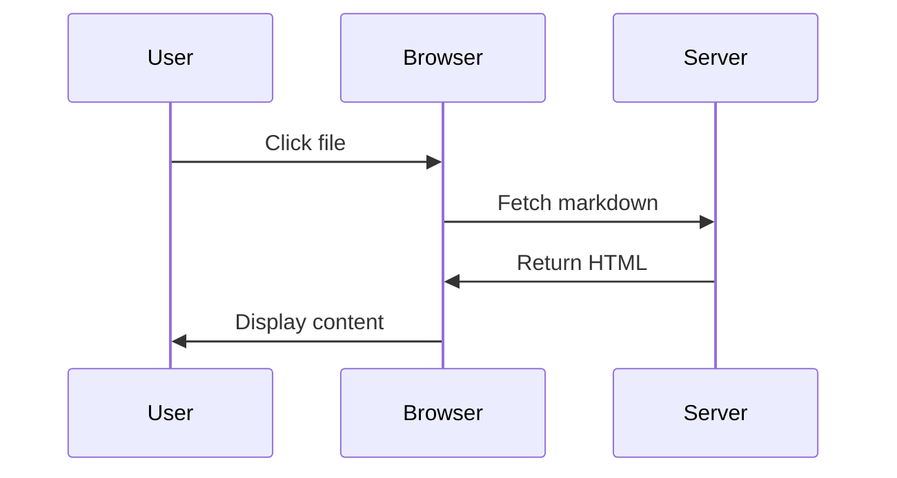
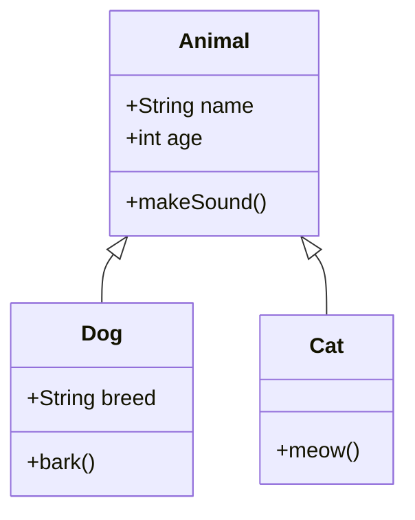

# Markdown Preview Test

This file tests various markdown rendering features.

## Headings

### Subheading
#### Sub-subheading

## Text Formatting

This is **bold text** and this is *italic text*.

Here's some `inline code` and a [link to Google](https://google.com).

## Lists

### Unordered List
- Item 1
- Item 2
  - Nested item 2.1
  - Nested item 2.2
- Item 3

### Ordered List
1. First item
2. Second item
3. Third item

## Code Block

```javascript
function hello() {
  console.log("Hello, World!");
  return true;
}
```

## Blockquote

> This is a blockquote
> It can span multiple lines

## Mermaid Diagrams

### Flowchart Example



### Sequence Diagram



### Class Diagram



## Table

| Feature | Status |
|---------|--------|
| Markdown | ✅ |
| Mermaid | ✅ |
| Styling | ✅ |

## Conclusion

This test file demonstrates that the markdown preview supports all standard markdown features plus Mermaid diagrams!
