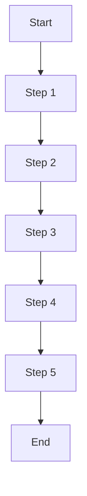
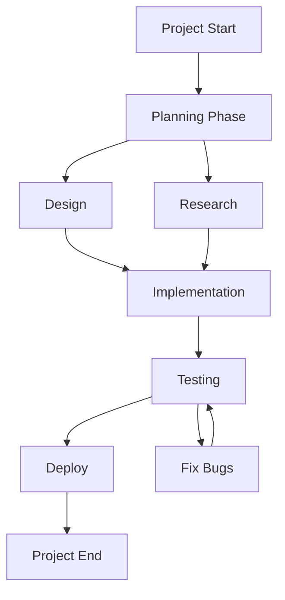
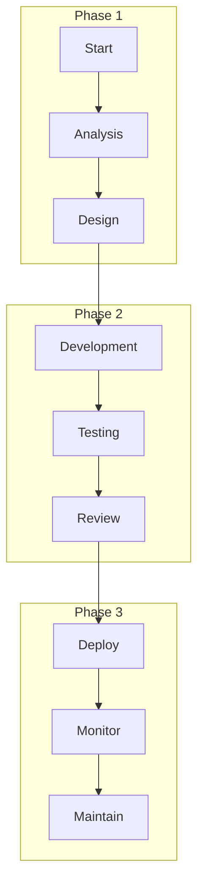

# Test Mermaid Vertical Rendering

## Simple Flow Chart

```mermaid
graph TB
    A[Start] --> B[Step 1]
    B --> C[Step 2]
    C --> D[Step 3]
    D --> E[Step 4]
    E --> F[Step 5]
    F --> G[End]
```

## Complex Flow with Branches

```mermaid
graph TB
    Start[Project Start] --> Planning[Planning Phase]
    Planning --> Design[Design]
    Planning --> Research[Research]
    Design --> Implementation[Implementation]
    Research --> Implementation
    Implementation --> Testing[Testing]
    Testing --> Deploy[Deploy]
    Testing --> FixBugs[Fix Bugs]
    FixBugs --> Testing
    Deploy --> End[Project End]
```

## Flow with Subgraphs

```mermaid
graph TB
    subgraph "Phase 1"
        A1[Start] --> B1[Analysis]
        B1 --> C1[Design]
    end
    
    subgraph "Phase 2"
        D2[Development] --> E2[Testing]
        E2 --> F2[Review]
    end
    
    subgraph "Phase 3"
        G3[Deploy] --> H3[Monitor]
        H3 --> I3[Maintain]
    end
    
    C1 --> D2
    F2 --> G3
```